# Assignment 1 - Karel the Robot


This assignment consists of four individual Karel programs. Before you start on this assignment, make sure you have read the handout, _Karel in PyCharm_, in its entirety. This document can be found in the **General Resources** section of the CS1114 Brightspace site. When you are ready to start working on these programs, you need to:

* Edit the program files so that the assignment actually does what its supposed to do. This will involve a cycle of coding, testing, and debugging until everything works. Your programs must run without producing any errors.
* Once you have gotten each part of a program to run correctly in the default world associated with the problem, you should make sure that your code runs properly in all of the worlds that we have provided for a given problem. Instructions on how to load new worlds for Karel to run in can be found in the _Karel in PyCharm_ guide.
* Submit your assignment on Gradescope via Brightspace under "Assignment 1 - Karel the Robot". You can submit more than one version of your code, but only the most recent submission will be graded. If you discover an error after you've made a submission, just fix the error in your program and submit a new copy. Submissions must include **all of the files for the assignment** (**collect_newspaper_karel.py**, **construction_karel.py**, **fire_fighter_karel.py**, and **fill_pothole_karel.py**) to receive full credit. Otherwise, Gradescope will not include the files submitted previously in the most recent submission.


The four Karel programs to solve are described below.

**Your Karel programs are restricted to the language features as described in lectures 1-4. You may not use any other features of Python. Prohibited features include (but are not limited to) variables, function parameters, arithmetic and comparison operators, `for` loops, `break`, and `return`, even though the PyCharm-based version of Karel allows their use.**

As a reminder, the functions available in your Karel programs are as follows:

|Function|Description|
|---|---|
|move()|Makes Karel move forward one square in the direction it is facing. Errors if there is a wall in front of Karel.|
|turn_left()|Makes Karel turn left.|
|pick_beeper()|Makes Karel pick up a beeper from the corner where it is currently standing. Errors if there are no beepers present on the corner.|
|put_beeper()|Makes Karel place a beeper on the corner where it is currently standing.|
|front_is_clear()|Is there no wall in front of Karel? Evaluates to `True` if answer is `Yes` and `False`, otherwise.|
|left_is_clear()|Is there no wall to Karel’s left? Evaluates to `True` if answer is `Yes` and `False`, otherwise.|
|right_is_clear()|Is there no wall to Karel’s right? Evaluates to `True` if answer is `Yes` and `False`, otherwise.|
|on_beeper()|Is there a beeper on the corner where Karel is standing? Evaluates to `True` if answer is `Yes` and `False`, otherwise.|
|facing_north()|Is Karel facing north? Evaluates to `True` if answer is `Yes` and `False`, otherwise.|
|facing_south()|Is Karel facing south? Evaluates to `True` if answer is `Yes` and `False`, otherwise.|
|facing_east|Is Karel facing east? Evaluates to `True` if answer is `Yes` and `False`, otherwise.|
|facing\_west()|Is Karel facing west? Evaluates to `True` if answer is `Yes` and `False`, otherwise.|


Remember, you can **and should** create your own functions when appropriate. It is **highly** recommended that you follow the progression through each step of the assignment. The problems are defined in a way that each problem builds on the one that proceeds it. So, skipping around may cause you to miss key problem-solving skills introduced in a previous problem.

Let's get started.

## TABLE OF CONTENTS
1. [Step 0 - Read the README](#step0)
1. [Decomposition](#decomposition)
1. [Instructions](#instructions)
    1. [Step 1 - Karel collects the newspaper](#step1)
    1. [Step 2 - Karel constructs buildings](#step2)
    1. [Step 3 - Karel fills potholes](#step3)
    1. [Step 4 - Karel fights fires](#step4)
1. [Evaluation](#eval)
1. [Assignment Submission](#submit)

### STEP 0 - READ THE README

Before writing a single line of code for this assignment, you are **strongly** encouraged to read this document in its entirety. The document includes key details about the expected implementation of your program. If you would like to consume this document in an alternative format, the README has also been converted to a PDF which is available in this folder.

<a name="decomposition"></a>
### DECOMPOSITION

A major focus of this assignment is to get you into the habit of decomposing your programming solutions using fuctions. You will not be instructed specifically on how to do the functional decomposition for this assignment. It will be helpful to keep the following in mind:

#### Good Code
```python
def fill_row_with_beepers():
    """Makes Karel move to the end of the row, dropping a 
    beeper before each step it takes
    
    pre-condition:      None
    
    post-condition:     Karel is facing
                        the same direction as before,
                        and every step between Karel's
                        old position and new position
                        has had a beeper added to it.
    """
    
    while front_is_clear():
         put_beeper()
         move()
    put_beeper()
```

#### Not-As-Good Code

```python
def fill_row_with_beepers():
    while front_is_clear():
         put_beeper()
         move()
    put_beeper()
```
    


The examples above show two functions with the same implementation. However, the function definitions differ in the documentation provided for the functions.

There are many ways to break these Karel problems down into smaller, more manageable pieces. Decomposing the problem elegantly into smaller sub-problems will result in a small number of easy-to-read functions, each of which performs just one small task. Decomposing the problem in other ways may result in functions that are trickier to understand and test. Look over your code and check to see whether you've decomposed the problem into smaller pieces. Does your code consist of a few enormous functions (not so good), or many smaller functions (good)?


<a name="instructions"></a>
### INSTRUCTIONS

<a name="step1"></a>
#### Step 1 - Karel collects the newspaper

Implementation file: **collect_newspaper_karel.py**  

Your first task is to solve a simple story-problem in Karel's world. Suppose that Karel has settled into its house, which is the square area in the center of **Figure 1A**. (The door to Karel's house is open in this world.)

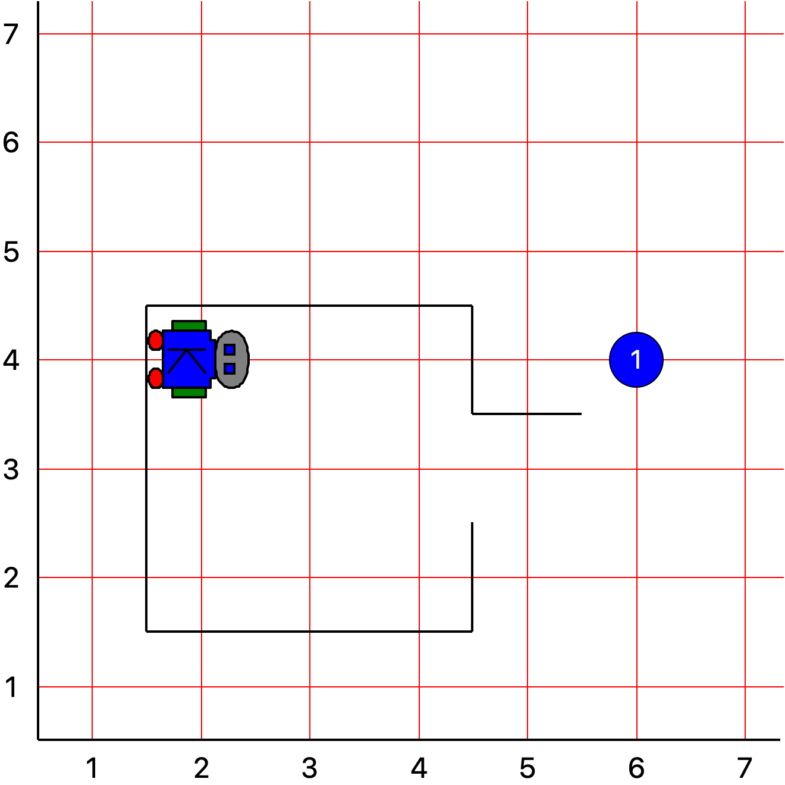  
<sub><sup>**Figure 1A** - Karel's starting state for **collect_newspaper_karel.py**</sup></sub>


Karel starts off in the northwest corner of its house as shown in the image above. The problem you need to solve is to get Karel to collect the newspaper. The newspaper, like all objects in Karel's world, is represented by a beeper. You must get Karel to pick up the newspaper located outside the doorway, to drop the newspaper off just inside the doorway, and then to return to its initial position. The image below shows the state of Karel's world when the program is complete. The direction that Karel is facing is not important but Karel should end up in the same location as when the program begins. 

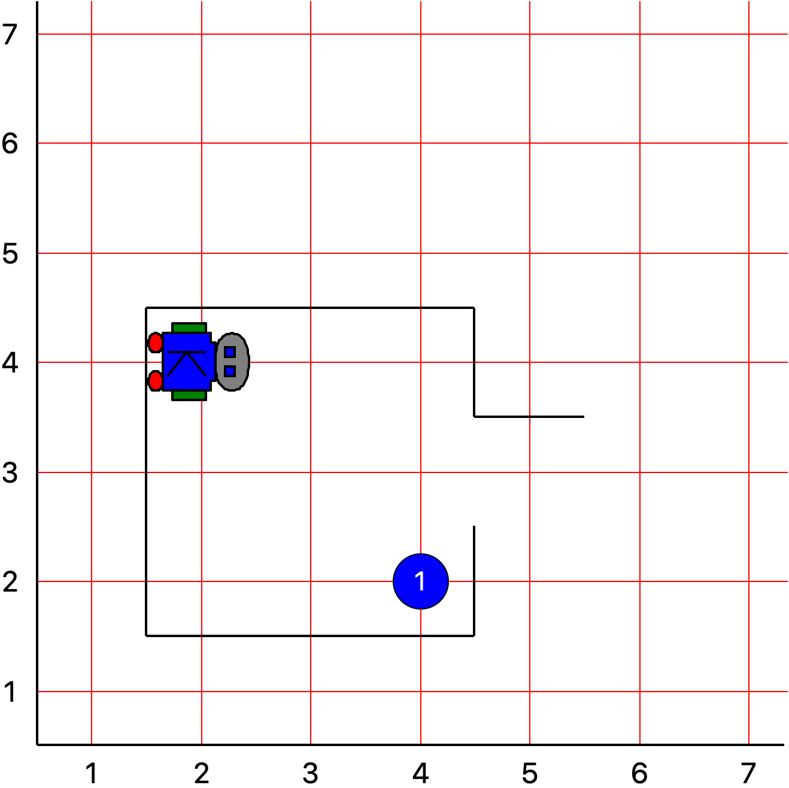  
<sub><sup>**Figure 1B** - Karel's ending state for **collect_newspaper_karel.py**</sup></sub>


This simple exercise is meant to help you get started programming with Karel. You can assume that every part of the world looks just as it does in the image: the house is exactly this size, the door is always in the position shown, and the beeper is just outside the door. Thus, all you have to do is write the sequence of instructions necessary to have Karel:

* Move to the newspaper,
* Pick up and drop off the newspaper, and
* Return to the starting point

Although the program should not require writing many lines of code, it is still worth getting some practice with decomposition. In your solution, include one function **for each of the tasks listed above**.

Your program should run successfully in the following world (all worlds are located in the **worlds** folder): **CollectNewspaper.kwld** (default)

<a name="step2"></a>
#### Step 2 - Karel constructs buildings

Implementation file: **construction_karel.py**

Tremendous amounts of construction have been happening in Downtown Brooklyn. Unfortunately, due to an economic downturn, some of the construction projects were abandoned prior to completion. With government assistance, Karel has been contracted to turn these incomplete buildings into affordable housing for Brooklyn residents. Your second task is to help Karel complete the construction of these buildings. Unfortunately, Karel is unsure of which buildings should be completed. Luckily, the buildings that Karel should develop have some foundational construction in place.

In this problem, Karel starts facing east in the southwest corner of the world. Avenues 2 and 4 are the only two potential locations where building construction may need to be completed. If either or both of those avenues have construction (represented by a single beeper at the street corners), Karel should complete a three-beeper-tall building. Keep in mind that the base of the building will already exist due to the previous construction efforts. If an avenue does not have building construction (represented by an empty corner), Karel should continue on without completing any construction.

Two sample runs are exhibited in **Figures 2 and 3**. In the first world, there are two buildings with incomplete construction; therefore, Karel completes two buildings. In the second world, there is only a single construction site on second avenue so Karel only completes construction of one building.

You can assume the following:
* There are only two possible locations with construction (the intersections of street 1 with avenues 2 and 4).
* The world will always be of size 6-by-6.
* Karel should always finish on the fifth avenue facing east.

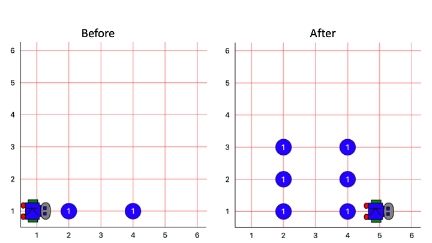  
<sub><sup>**Figure 2** - Example run 1 for **construction_karel.py**</sup></sub>

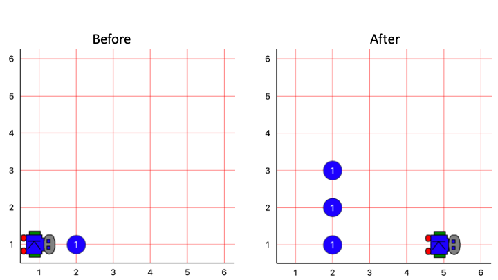  
<sub><sup>**Figure 3** - Example run 2 for **construction_karel.py**</sup></sub>


Your program should run successfully in all of the following worlds (all worlds are located in the **worlds** folder): **Construction1.kwld** (default), **Construction2.kwld**, **Construction3.kwld**, **Construction4.kwld**.

<a name="step3"></a>
#### Step 3 - Karel fills potholes

Implementation file: **fill_pothole_karel.py**
 
Your third task is to help Karel fill potholes on Flatbush Avenue in Brooklyn. We'll start with a simpler version of the task - a segment of Flatbush with only two potholes (pictured in **Figures 7 and 8**) - and then generalize our code to work on a road with any number of potholes. You should break the problem down into the following steps (which we'll walk through below):
1. Write a function called `fill_pothole()` that fills a single pothole (beginning and end states pictured in **Figure 7**).
1. Use your `fill_pothole()` function to solve the problem for the two-pothole world with seven avenues (beginning and end states pictured in **Figure 8**).
1. Generalize your code so that it will work in any size world where there is any number of avenues and potholes can be at any avenue, not just the second and fifth (beginning and end states pictured in **Figure 9**).
1. Generalize your code so that Karel doesn’t fill potholes that are already filled (beginning and end states pictured in **Figure 10**).


As always, be sure that this Karel program works in different worlds. Maybe there are segments of Flatbush Avenue that have more potholes than other segments or that have potholes which have already been filled in by someone else.

Specifically, you should start with the default **TwoPotholes.kwld** file and then change the world file to **RegularPotholes.kwld** for task 3 and to **AllPotholes1.kwld** for task 4. When finished, you should make sure that your final program runs in **AllPotholes1.kwld** and **AllPotholes2.kwld** and that it still works for **TwoPotholes.kwld** and **RegularPotholes.kwld**.

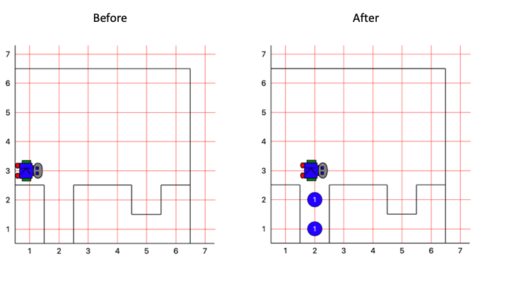   
<sub><sup>**Fig 7** - The beginning and end states for the `fill_pothole()` function.</sup></sub>

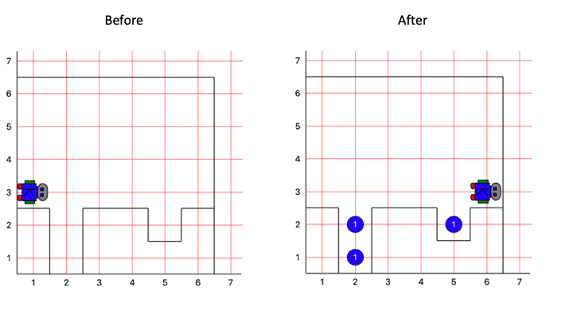  
<sub><sup>**Fig 8** - The beginning and end states for Karel in a simple two-pothole world.</sup></sub>

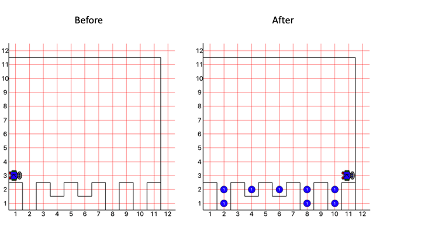  
<sub><sup>**Fig 9** - The beginning and end states for Karel in a world with many potholes.</sup></sub>


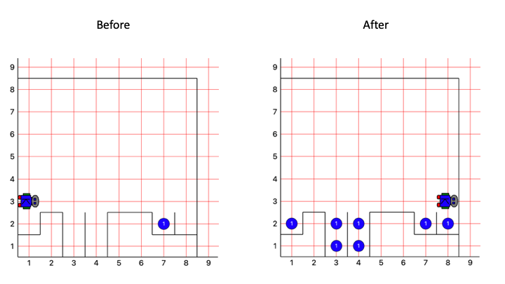  
<sub><sup>**Fig 10** - The beginning and end states for Karel in a world with some potholes already filled.</sup></sub>


You should note that:
* Your final program shouldn't make any assumptions about the number of avenues in the world.
* No pothole will ever be more than 2 beepers deep. Therefore, you only need to consider a solution for potholes of one of these two sizes.
* Potholes may need to be filled in both the first and last avenues of the world.


Your program should run successfully in all of the following worlds (all worlds are located in the **worlds** folder): **TwoPotholes.kwld** (default), **RegularPotholes.kwld**, **AllPotholes1.kwld**, **AllPotholes2.kwld**.

<a name="step4"></a>
#### Step 4 - Karel fights fires

Implementation file: **fire_fighter_karel.py**

Karel has joined the local fire department. Your final task is to help Karel extinguish fires (represented as beepers) in some oddly-shaped buildings. For this problem, Karel starts facing south next to a "building" (represented by a rectangle constructed from walls) whose sides span one or more street corners. Karel's goal is to extinguish all of the fires occurring in buildings present in the world by removing all beepers inside the building walls. The intensity of the fires are signified by the number of beepers (the number displayed on the beeper) present at any given intersection. To "extinguish" a fire, Karel will need to remove **all** beepers representing the fire.

You should break down the problem into the following steps: 

* First, Karel should extinguish the fires on one side of the rectangle, removing beepers from all intersections that are adjacent to the wall of the building. 
* Next, Karel should accomplish the task of extinguishing all fires in a single rectangle. Think about how you can use the functionality of the previous subtask to help you accomplish this goal. You may need to write a small amount of code to reposition Karel in between extinguishing fires along individual walls of a building.
* Finally, the overall goal of the **Fire Fighter Karel** problem is to extinguish the fires in all three buildings in the world. Again, you may need to write a small amount of code to reposition Karel in between extinguishing fires in individual buildings.


Figures demonstrating the before and after stages of each of the three steps are shown below. 

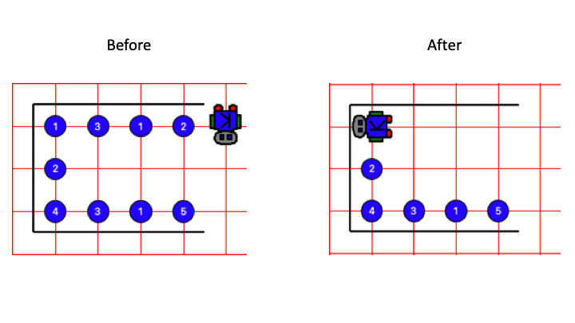  
<sub><sup>**Figure 4** - After you’ve completed the first step of **fire_fighter_karel.py**, Karel should be able to extinguish fires from one side of one building.</sup></sub>

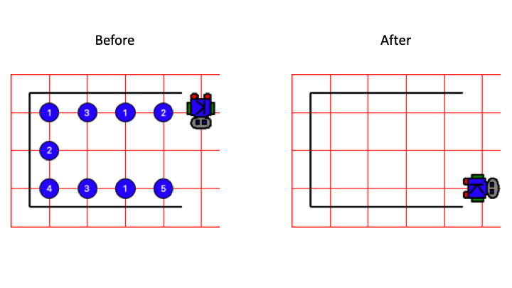  
<sub><sup>**Figure 5** - After you’ve completed the second step, Karel should be able to extinguish fires from one building.</sup></sub>

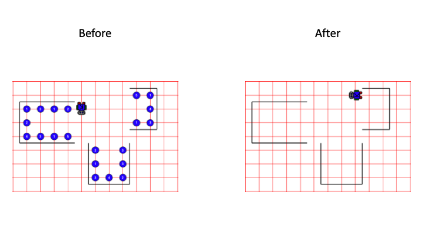  
<sub><sup>**Figure 6** - After you have extinguished all fires, the end result should look like this.</sup></sub>


You can assume the following:
* Karel will always start facing south next to the upper right corner of the leftmost building (at the position adjacent to where the first fire should be extinguished).
* Although buildings may be of varying sizes, there will always be exactly three of
them, and their relative position to one another will always be the same (as
displayed in **Figure 6**). If you are still confused about what assumptions you can
make about the world, see the additional *Fire* world files included for this assignment.

Your program should run successfully in all of the following worlds (all worlds are located in the **worlds** folder): **Fire1.kwld** (default), **Fire2.kwld**, **Fire3.kwld**.


<a name="eval"></a>
### EVALUATION

With the exception of **CollectNewspaperKarel**, all of the Karel problems you will solve should work in a variety of different worlds that match the problem specifications. Each problem includes a comprehensive list of worlds in which your Karel program should run successfully. All of these provided worlds exist in the **worlds** folder in your assignment folder. These worlds are all of the files with which your code will be evaluated while grading, so make sure to run your code on all of the worlds provided.

It is just as important to write clean and readable code as it is to write correct and functional code. A portion of your grade on this assignment (and the assignments that follow) will be based on how well you follow certain coding conventions. Make sure to follow the standards discussed in class, and before you submit your assignment, take a minute to review your code to check for stylistic issues like those mentioned below.

#### Karel Features
The program only uses the language features covered in lecture (**def**, **if**, **while**, **not**, **and**, **or**).

#### Comments
To make your program easier to read, add docstrings and comments inside your functions to make your intention clearer. Good comments give the reader a clue about what a function does and, in some cases, how it works. Write pre- and post-conditions for each function, as shown in the example function, `fill_row_with_beepers()`, presented in the **DECOMPOSITION** section.

Be sure to include header comments (including your name) for each of the files to be submitted.

#### Function design

Function names should include verbs indicating what is accomplished by the function. 

All words in a function name should be written in lower-case letters.

Multiple words in a function name should be separated by underscores.

Functions should be decomposed such that the length of each is small. This is an important part of proper decomposition. There is a bit of an art to this but you should ensure that your functions solve well-defined sub-problems. The function definitions should not, in general, have 10s of lines of codes. This is especially true for the programs written in this class.

#### Proper indentation
Indentation should be consistent in the files that are submitted. The convention is that each block of indented code is indented using four spaces. Your program indentation format must be consistent.

<a name="submit"></a>
### ASSIGNMENT SUBMISSION

You should submit the following files (do not include any files not included in the list below):
* **collect_newspaper_karel.py**
* **construction_karel.py**
* **fill_pothole_karel.py**
* **fire_fighter_karel.py**

If you want to make changes to your submission for even a single file, be sure to include all 4 files in the new submission. This is how to properly re-submit using Gradescope.

### ACKNOWLEDGEMENTS

Karel resources developed by Stanford University Computer Science department. 

